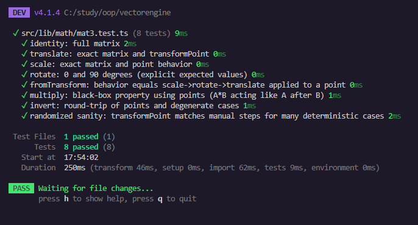

# Отчёт по лабораторной работе №3
- Цигельник Юля Б9124-09.03.03пикд(3)
- https://github.com/yunohaha/vectorengine/tree/lab-3

---
## Цель работы
Реализовать математический модуль для выполнения аффинных преобразований (перемещение, масштабирование, поворот) с использованием матриц 3×3.

### Реализация умножения матриц

Функция перемножает две матрицы 3×3. Умножение матриц необходимо для комбинирования нескольких преобразований (перемещение, поворот, масштаб) в одно.

```typescript
multiply(a: Mat3, b: Mat3): Mat3 {
    const result: Mat3 = [0, 0, 0, 0, 0, 0, 0, 0, 0];
    
    for (let r = 0; r < 3; r++) {
        for (let c = 0; c < 3; c++) {
            let sum = 0;
            for (let k = 0; k < 3; k++) { // скалярное произведение
                sum += a[r * 3 + k] * b[k * 3 + c];
            }
            result[r * 3 + c] = sum;
        }
    }
    return result;
}
```

### Реализация translate()

Функция `translate(tx, ty)` создает матрицу 3×3, которая выполняет параллельный перенос точки на вектор `(tx, ty)`. Это одна из основных операций в векторном редакторе — перемещение объектов мышкой.

```typescript
translate(tx: number, ty: number): Mat3 {
    return [
        1, 0, tx,
        0, 1, ty,
        0, 0, 1
    ];
}
```
### Реализация scale()

Функция `scale(sx, sy)` создает матрицу 3×3, которая выполняет масштабирование (растяжение/сжатие) точки относительно начала координат.

```typescript
scale(sx: number, sy: number): Mat3 {
    return [
        sx, 0, 0,
        0, sy, 0,
        0, 0, 1
    ];
}
```
### Реализация rotate()

Функция создает матрицу поворота. Когда мы умножаем эту матрицу на точку, точка поворачивается вокруг начала координат (0,0) на заданный угол.

```typescript
rotate(rad: number): Mat3 {
    const c = Math.cos(rad);
    const s = Math.sin(rad);
    return [
        c, -s, 0,
        s,  c, 0,
        0,  0, 1
    ];
}
```
### Реализация fromTransform()

Создает одну матрицу, которая делает сразу три действия: сначала масштабирует, потом поворачивает, потом перемещает.
Матрицы умножаются справа налево. Если мы хотим: сначала масштаб, потом поворот, потом перемещение, то записываем:
`M = T × (R × S)`
Если перепутать порядок (сначала переместить, потом повернуть), то объект будет вращаться не вокруг своего центра, а вокруг начала координат (как планета вокруг Солнца).

```typescript
fromTransform(
    tx: number, ty: number,    
    rotationRad: number,       
    sx: number, sy: number      
): Mat3 {
    const T = this.translate(tx, ty);
    const R = this.rotate(rotationRad);
    const S = this.scale(sx, sy);
    
    const RS = this.multiply(R, S);
    return this.multiply(T, RS);
}
```
### Реализация transformPoint()

Умножает матрицу 3×3 на точку (x, y) и возвращает новую точку.

```typescript
transformPoint(m: Mat3, x: number, y: number): Point2D {
    return {
        x: m[0] * x + m[1] * y + m[2],
        y: m[3] * x + m[4] * y + m[5]
    };
}
```

### Реализация invert()
Создает обратную матрицу, которая "отменяет" действие исходной матрицы.

```typescript
invert(m: Mat3): Mat3 | null {
    const a = m[0], b = m[1], tx = m[2];
    const c = m[3], d = m[4], ty = m[5];
    
    const det = a * d - b * c;
    
    if (Math.abs(det) < 1e-10) {
        return null;
    }
    
    const invDet = 1 / det;
    
    return [
        d * invDet,
        -b * invDet,
        (b * ty - d * tx) * invDet,
        
        -c * invDet,
        a * invDet,
        (c * tx - a * ty) * invDet,
        
        0, 0, 1
    ];
}
```

## Тестирование

Для проверки корректности работы математического модуля используется фреймворк **Vitest**. Тесты покрывают все реализованные функции и проверяют как отдельные операции, так и их комбинации.

### Установка и настройка Vitest

```bash
npm install -D vitest
```

### Результат выполнения тестов


**Итого:** 8 из 8 тестов пройдено

## Вывод

В ходе выполнения лабораторной работы был разработан математический модуль для аффинных преобразований в 2D-пространстве.

**Реализованные функции:**
- `identity()` — создание единичной матрицы
- `multiply()` — умножение матриц
- `translate()` — перемещение
- `scale()` — масштабирование
- `rotate()` — поворот
- `fromTransform()` — комбинация Scale → Rotate → Translate
- `transformPoint()` — применение матрицы к точке
- `invert()` — вычисление обратной матрицы
