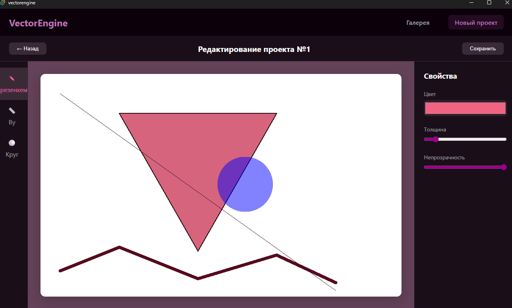
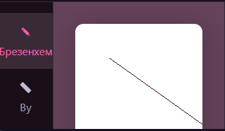
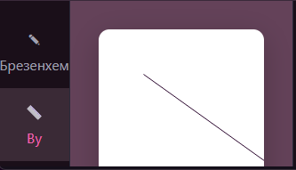
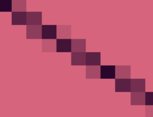
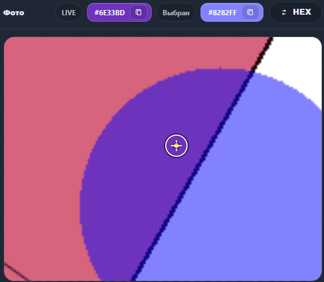
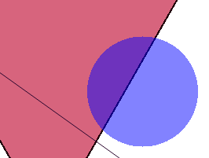
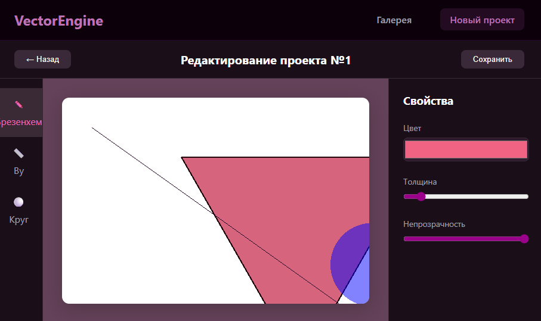
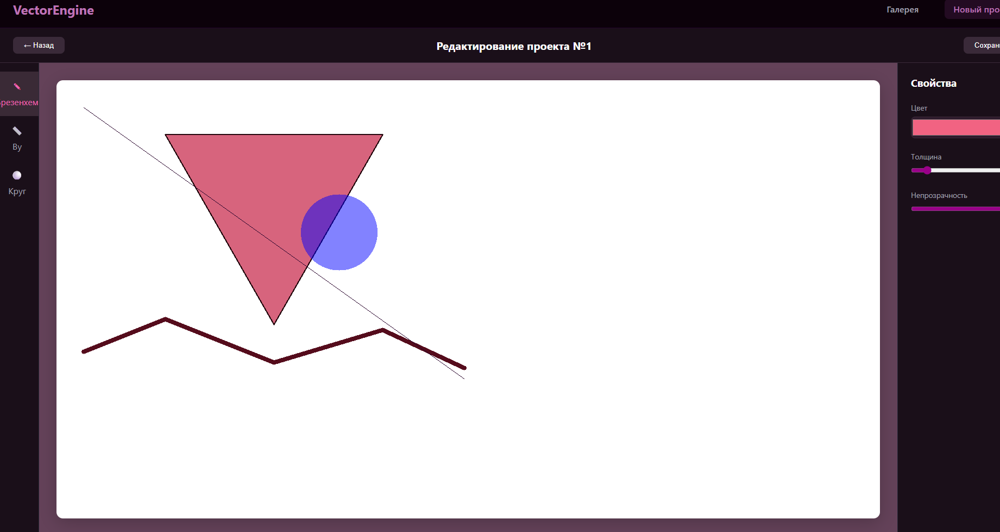

# Отчёт по лабораторной работе №4
- Цигельник Юля Б9124-09.03.03пикд(3)
- https://github.com/yunohaha/vectorengine/tree/lab-4

---
### Цель работы
Изучить принципы формирования растрового изображения, освоить
прямую манипуляцию массивом пикселей (FrameBuffer) и реализовать базовые
алгоритмы компьютерной графики без использования встроенных функций рисования.

---

### Теория

Цвет каждого пикселя описывается 4 числами:

| Канал | Что означает |	Диапазон |
|-------|--------------|-------------|
|R (Red) |	Красный  |	0-255 |
|G (Green) |	Зелёный	 | 0-255 |
|B (Blue)	| Синий	| 0-255 |
| A (Alpha)	| Прозрачность |0-255 |

Все эти числа хранятся в одном длинном списке (массиве). Как найти пиксель с координатами (x, y)? Есть формула:

```
индекс = (y × ширина_экрана + x) × 4
```

Умножаем на 4, потому что у каждого пикселя 4 числа (R, G, B, A).

Пример: Экран 10×10, хотим найти пиксель (3, 2):

```
индекс = (2 × 10 + 3) × 4 = (20 + 3) × 4 = 23 × 4 = 92

```

Значит:
- массив[92] — красный
- массив[93] — зелёный
- массив[94] — синий
- массив[95] — прозрачность

---
## Реализация вспомогательных функций

### 1. Функция clampByte()

Oграничивает число диапазоном от 0 до 255 и округляет до целого. Это необходимо, потому что цвета могут быть только целыми числами от 0 до 255. При математических операциях могут получаться значения 300 или -50 — их нужно привести к допустимому диапазону.

```ts
export function clampByte(v: number): number {
    return Math.max(0, Math.min(255, Math.round(v)));
}
```

`Math.round(v)` — округляет число до ближайшего целого
`Math.min(255, округлённое_число)` — если число больше 255, берём 255
`Math.max(0, результат_шага_2)` — если число меньше 0, берём 0

### 2. Функция hexToRGBA()

Преобразует строку с цветом в формате HEX (например, "#FF0000" или "#F00") в объект RGBA. Это удобно, когда пользователь выбирает цвет через цветовую палитру (input type="color"), которая возвращает именно HEX-строку.

```ts
export function hexToRGBA(hex: string, alpha = 255): RGBA {
    hex = hex.replace('#', '');

    if (hex.length == 3){
        hex = hex.split('').map(c => c + c).join('');
    }

    const r = parseInt(hex.substring(0, 2), 16);
    const g = parseInt(hex.substring(2, 4), 16);
    const b = parseInt(hex.substring(4, 6), 16);
    
    return {r, g, b, a: alpha };
}
```
1. `hex.replace('#', '')` — удаляем символ # в начале строки, если он есть

2. Проверяем длину строки: если 3 символа (например, "F00"), значит это короткая запись

3. Разворачиваем короткую запись: "F00" → "FF0000" (каждый символ удваивается)

4. `parseInt(hex.substring(0,2), 16)` — берём первые 2 символа и переводим из 16-ричной системы в обычное число

5. Аналогично для зелёного и синего

6. Возвращаем объект RGBA с указанной прозрачностью

---

## Реализация класса RasterRenderer
### 1. Конструктор и поля класса

Класс управляет буфером пикселей, хранит размеры canvas и предоставляет методы для рисования.
```ts
export class RasterRenderer {
    private ctx: CanvasRenderingContext2D;
    private imageData: ImageData | null = null;
    private buf!: Uint8ClampedArray;

    width = 0; // физические пиксели
    height = 0; // физические пиксели
    dpr = 1;

    private canvas: HTMLCanvasElement;
    private _onWindowResize: () => void;
    private lineAlg: LineAlg = 'bresenham';
    constructor(canvas: HTMLCanvasElement) {
        this.canvas = canvas;
        const ctx = canvas.getContext('2d');
        if (!ctx) {
            throw new Error('No 2D context');
        }
        this.ctx = ctx;
        this._onWindowResize = () => this.resize();
        window.addEventListener('resize', this._onWindowResize);
        this.resize();
    }
    dispose() {
        window.removeEventListener('resize', this._onWindowResize);
    } 
```
- `ctx` — контекст canvas, через который мы будем выводить картинку на экран
- `imageData` — объект, в котором хранится массив пикселей
- `buf` — ссылка на массив пикселей (для удобства)
- `width` и `height` — физические размеры canvas (с учётом DPR)
- `dpr` — коэффициент плотности пикселей (1 на обычном экране, 2 на Retina)
- `lineAlg` — выбранный алгоритм рисования линий

### 2. Метод idx() — вычисление индекса пикселя
По координатам (x, y) находит позицию в одномерном массиве, где хранятся RGBA-компоненты пикселя.

Массив buf — это одномерный список чисел. Каждый пиксель занимает 4 последовательных элемента: R, G, B, A. Чтобы найти индекс первого элемента пикселя (красный канал), нужно умножить номер строки на ширину, прибавить номер столбца и умножить на 4.

Формула: `index = (y × width + x) × 4`

```ts
private idx(x: number, y: number): number {
    return (y * this.width + x) * 4;
}
```
### 3. Метод setPixel() — установка пикселя
Записывает цвет заданного пикселя в буфер.

```ts
setPixel(x: number, y: number, color: RGBA) {
        
        if (x < 0 || y < 0 || x >= this.width || y >= this.height) return;

        const i = this.idx(x, y);

        this.buf[i] = clampByte(color.r);
        this.buf[i+1] = clampByte(color.g);
        this.buf[i+2] = clampByte(color.b);
        this.buf[i+3] = clampByte(color.a);

    }
```
1. Сначала проверяем, что координаты не выходят за пределы canvas
2. Вычисляем индекс пикселя с помощью метода idx()
3. Записываем красный компонент в массив по индексу i
4. Записываем зелёный компонент в i+1
5. Записываем синий компонент в i+2
6. Записываем прозрачность в i+3
7. Все значения пропускаем через clampByte(), чтобы они гарантированно были в диапазоне 0-255

### 4. Метод blendPixel() — смешивание цветов
Накладывает новый пиксель поверх старого с учётом прозрачности (альфа-блендинг). Если мы рисуем полупрозрачный объект, цвета должны смешиваться, а не заменяться.

Используется формула Source Over:
`α_out = α_src + α_dst × (1 - α_src)`
`C_out = (C_src × α_src + C_dst × α_dst × (1 - α_src)) / α_out`

```ts
private blendPixel(x: number, y: number, color: RGBA, alphaFactor = 1) {

        if (x < 0 || y < 0 || x >= this.width || y >= this.height) return;

        const i = this.idx(x, y);


        let srcA  = (color.a / 255) * alphaFactor;
        srcA = Math.min(1, Math.max(0, srcA));

        if (srcA <= 0) return;

        const dstR = this.buf[i] / 255;
        const dstG = this.buf[i + 1] / 255;
        const dstB = this.buf[i + 2] / 255;
        const dstA = this.buf[i + 3] / 255;

        const srcR = color.r / 255;
        const srcG = color.g / 255;
        const srcB = color.b / 255;

        if (srcA >=1){
            this.buf[i] = clampByte(color.r);
            this.buf[i+1] = clampByte(color.g);
            this.buf[i+2] = clampByte(color.b);
            this.buf[i+3] = 255;
            return;
        }

        const outR = srcR * srcA + dstR * dstA * (1 - srcA);
        const outG = srcG * srcA + dstG * dstA * (1 - srcA);
        const outB = srcB * srcA + dstB * dstA * (1 - srcA);
        const outA = srcA + dstA * (1 - srcA);

        if (outA > 0) {
            this.buf[i] = clampByte(outR* 255);
            this.buf[i + 1] = clampByte(outG* 255);
            this.buf[i + 2] = clampByte(outB * 255);
            this.buf[i + 3] = clampByte(outA * 255);

        }else {
            this.buf[i] = 0;
            this.buf[i + 1] = 0;
            this.buf[i + 2] = 0;
            this.buf[i + 3] = 0;
        }

    }
```
**Особенности реализации:**
- Все значения нормализуются к диапазону [0, 1] для вычислений
- Если пиксель полностью прозрачный (`α_src = 0`) — ничего не меняется
- Если пиксель полностью непрозрачный (`α_src = 1`) — просто заменяет старый цвет
- Результат переводится обратно в диапазон [0, 255] и записывается в буфер

**Алгоритм:**
1. Проверка границ canvas
2. Вычисление индекса пикселя в буфере
3. Нормализация альфы нового цвета (деление на 255)
4. Нормализация текущих значений из буфера
5. Если альфа = 0 → выход
6. Если альфа = 1 → замена пикселя
7. Иначе — вычисление нового цвета по формуле Source Over
8. Запись результата в буфер с обратным переводом в диапазон 0-255


### 5. Метод resize() — настройка размера canvas
Подстраивает размеры canvas под экран пользователя с учётом Retina-дисплеев. Это критически важно, чтобы картинка не была размытой.
На Retina-экранах один CSS-пиксель может занимать 4 физических пикселя. Если не учесть `devicePixelRatio`, картинка будет растянута и размыта.

```ts
resize() {
        this.dpr = window.devicePixelRatio || 1;
    
        const rect = this.canvas.getBoundingClientRect();
        const cssWidth = rect.width;
        const cssHeight = rect.height;
        
        this.width = Math.max(1, Math.floor(cssWidth * this.dpr));
        this.height = Math.max(1, Math.floor(cssHeight * this.dpr));

        this.canvas.width = this.width;
        this.canvas.height = this.height;
        
        this.canvas.style.width = `${cssWidth}px`;
        this.canvas.style.height = `${cssHeight}px`;
        
        this.imageData = this.ctx.createImageData(this.width, this.height);
        this.buf = this.imageData.data;
    }
```
1. `window.devicePixelRatio` — узнаём коэффициент плотности пикселей (1 на обычном экране, 2 на Retina)
2. `getBoundingClientRect()` — получаем фактический размер элемента на странице
3. Умножаем CSS-размеры на DPR, чтобы получить физические размеры
4. Устанавливаем физические размеры canvas (`canvas.width` и `canvas.height`)
5. Устанавливаем CSS-размеры (`canvas.style.width` и `canvas.style.height`)
6. Создаём новый `ImageData` нужного размера
7. Сохраняем ссылку на массив пикселей в `this.buf`


### 6. Методы beginFrame() и commit()
Очистка буфера перед рисованием и вывод результата на экран.

```ts
beginFrame(clear = true) {
        if (clear) {
            for (let i = 0; i < this.buf.length; i++) {
                this.buf[i] = 0;
            }
        }
    }

    commit() {
        if (this.imageData) {
            this.ctx.putImageData(this.imageData, 0, 0);
        }
    }
 ```
`beginFrame(true)` — очищает буфер, заполняя его нулями. Это нужно, чтобы на следующем кадре не осталось старых рисунков.
`commit()` — копирует наш буфер пикселей на экран. Это единственная встроенная функция canvas, которую мы используем.

### 7. Метод drawHSpan() — горизонтальная линия
Закрашивает горизонтальную линию от x0 до x1 на строке y. Этот метод используется всеми алгоритмами заливки (круги, многоугольники).

```ts 
 private drawHSpan(y: number, x0: number, x1: number, color: RGBA) {
        let startX = Math.min(x0, x1);  
        let endX = Math.max(x0, x1);    
        
        for (let x = startX; x <= endX; x++) {
        if (color.a < 255) {
            this.blendPixel(x, y, color);
        } else {
            this.setPixel(x, y, color);
        }
    }
    }
```
1. Упорядочиваем x0 и x1, чтобы startX был меньше `endX`
2. В цикле от `startX` до `endX` рисуем пиксели
3. для поддержки прозрачности при заливке фигур метод `drawHSpan` был модифицирован: 
- Если цвет полностью непрозрачный (`a = 255`), используется `setPixel` (прямая запись)
- Если цвет имеет прозрачность (`a < 255`), используется `blendPixel` (смешивание)

Все заливки (круги, треугольники) в конечном итоге сводятся к рисованию горизонтальных линий. Это проще и быстрее, чем рисовать каждый пиксель по отдельности.

### 8. Метод drawLineBrassenham() — линия Брезенхема
Рисует линию ступенчатым алгоритмом. Этот алгоритм использует только целые числа и работает очень быстро.

На каждом шаге алгоритм решает, в какую сторону идти: по горизонтали или по вертикали. Решение принимается на основе "ошибки" — расстояния от идеальной линии до текущего пикселя.

```ts
drawLineBrassenham(x0: number, y0: number, x1: number, y1: number, color: RGBA) {
        let dx = Math.abs(x1 - x0); // разница по X
        let dy = Math.abs(y1 - y0); // разница по Y

        const sx = x0 < x1 ? 1 : -1; // направление по X (вправо/влево)
        const sy = y0 < y1 ? 1 : -1; // направление по Y (вниз/вверх)

        let err = dx - dy; // начальная ошибка

        let x = x0;
        let y = y0;

        while (true) {

            this.setPixel(x, y, color); // рисуем текущий пиксель

            if (x === x1 && y === y1) break; // дошли до конца
            const e2 = 2 * err; // удвоенная ошибка
            if (e2 > -dy) {
                err -= dy;
                x += sx; // идём по X
            }

            if (e2 < dx) {
                err += dx;
                y += sy;  // идём по Y
            }
        }
        
    }
```

1. Вычисляем разницу по X и Y
2. Определяем направление движения (вправо или влево, вниз или вверх)
3. Инициализируем ошибку как `dx - dy`
4. В цикле рисуем текущий пиксель
5. Если дошли до конечной точки — выходим
6. Вычисляем `e2 = 2 × err`
7. Если `e2 > -dy`, двигаемся по X и обновляем ошибку
8. Если `e2 < dx`, двигаемся по Y и обновляем ошибку

### 9. Метод drawLineWu() — сглаженная линия Ву
Рисует линию с плавными краями (антиалиасинг). В отличие от Брезенхема, этот алгоритм рисует два пикселя на каждом шаге с разной интенсивностью.

Чем ближе идеальная линия к центру пикселя, тем выше его яркость. Чем дальше — тем ниже. Это создаёт иллюзию плавной линии.

**Ключевая идея**: Вместо выбора одного пикселя (как в алгоритме Брезенхема), алгоритм Ву закрашивает оба соседних пикселя, но с разной прозрачностью, пропорциональной расстоянию от идеальной линии до центра каждого из них.

Математическая модель:

Пусть `d` — расстояние от идеальной линии до ближайшего пикселя (0 ≤ d ≤ 1). Тогда:
- Ближайший пиксель получает яркость (1 - d)
- Следующий пиксель получает яркость d

Сумма яркостей всегда равна 1, что соответствует полной интенсивности линии.

```ts
drawLineWu(x0: number, y0: number, x1: number, y1: number, color: RGBA) {
        const fpart = (x: number ) => x - Math.floor(x);
        const rfpart = (x: number) => 1 - fpart(x);

        const plot = (x: number, y: number, brightness: number) => {
            this.blendPixel(x, y, color, brightness);
        };

        let steep = Math.abs(y1 - y0) > Math.abs(x1 - x0);

        if (steep) {
            [x0, y0] = [y0, x0];
            [x1, y1] = [y1, x1];
        }

        if (x0 > x1) {
            [x0, x1] = [x1, x0];
            [y0, y1] = [y1, y0];
        }

        let dx = x1 - x0;
        let dy = y1 - y0;
        let gradient = dy / dx;

        let xend = Math.round(x0);
        let yend = y0 + gradient * (xend - x0);

        let xgap = rfpart(x0 + 0.5);

        let xpxl1 = xend;
        let ypxl1 = Math.floor(yend);

        if (steep) {
            plot(ypxl1, xpxl1, rfpart(yend) * xgap);
            plot(ypxl1 + 1, xpxl1, fpart(yend) * xgap);
        } else {
            plot(xpxl1, ypxl1, rfpart(yend) * xgap);
            plot(xpxl1, ypxl1 + 1, fpart(yend) * xgap);
        }

        let intery = yend + gradient;
        
        // Обработка конечной точки
        xend = Math.round(x1);
        yend = y1 + gradient * (xend - x1);
        xgap = fpart(x1 + 0.5);
        let xpxl2 = xend;
        let ypxl2 = Math.floor(yend);
        
        if (steep) {
            plot(ypxl2, xpxl2, rfpart(yend) * xgap);
            plot(ypxl2 + 1, xpxl2, fpart(yend) * xgap);
        } else {
            plot(xpxl2, ypxl2, rfpart(yend) * xgap);
            plot(xpxl2, ypxl2 + 1, fpart(yend) * xgap);
        }

        if (steep) {
            for (let x = xpxl1 + 1; x <= xpxl2 - 1; x++) {
                let y = Math.floor(intery);
                plot(y, x, rfpart(intery));
                plot(y + 1, x, fpart(intery));
                intery += gradient;
            }
        } else {
            for (let x = xpxl1 + 1; x <= xpxl2 - 1; x++) {
                let y = Math.floor(intery);
                plot(x, y, rfpart(intery));
                plot(x, y + 1, fpart(intery));
                intery += gradient;
            }
        }
    } 
```
**Подробный разбор:**

**Вспомогательные функции:**

```ts
const fpart = (x: number) => x - Math.floor(x);
const rfpart = (x: number) => 1 - fpart(x);
```
- `fpart(x)`  - Возвращает дробную часть числа (то, что после запятой)
- `rfpart(x)` - Возвращает 1 минус дробную часть

Вместе они описывают распределение яркости между двумя соседними пикселями

**Определение крутизны линии**

```ts
let steep = Math.abs(y1 - y0) > Math.abs(x1 - x0);
```
- |dy| > |dx| -- true -- Линия крутая (выше, чем шире)
- |dy| ≤ |dx| -- false -- Линия пологая (шире, чем выше)

Алгоритм Ву проще реализовать для пологих линий (когда мы идём по X). Для крутых линий мы временно меняем X и Y местами (транспонируем), обрабатываем как пологую, а затем при отрисовке меняем координаты обратно.

**Транспонирование крутой линии**

```ts
if (steep) {
    [x0, y0] = [y0, x0];
    [x1, y1] = [y1, x1];
}
```
Переставляет точки так, чтобы `x0` был меньше `x1`. То есть мы всегда рисуем слева направо.
Алгоритм Ву предполагает, что мы идём по X от меньшего к большему. Это упрощает код.

**Вычисление градиента**

```ts
let dx = x1 - x0;
let dy = y1 - y0;
let gradient = dy / dx;

```

**Обработка первого конца линии**

***Вычисление координат конца***

```ts
let xend = Math.round(x0);
let yend = y0 + gradient * (xend - x0);
```
- `xend` -- Ближайшее целое X к начальной точке	
- `yend` -- Точное значение Y на идеальной линии для этого X

Начальная точка может не попадать точно в центр пикселя. Нужно правильно вычислить яркость для пикселей на конце линии.

**Вычисление зазора (xgap)**

```ts
let xgap = rfpart(x0 + 0.5);
```
Вычисляет, насколько далеко начальная точка находится от центра пикселя.
Центр пикселя с координатой floor(x0) находится на расстоянии 0.5 от его левого края. Прибавляя 0.5, мы получаем расстояние от этого центра.

**Определение координат пикселя**
```ts
let xpxl1 = xend;
let ypxl1 = Math.floor(yend);
```
- xpxl1 — X-координата пикселя (целое число)
- ypxl1 — Y-координата нижнего пикселя (целое число, округлённое вниз)

**Отрисовка двух пикселей на конце**

```ts
if (steep) {
    plot(ypxl1, xpxl1, rfpart(yend) * xgap);
    plot(ypxl1 + 1, xpxl1, fpart(yend) * xgap);
} else {
    plot(xpxl1, ypxl1, rfpart(yend) * xgap);
    plot(xpxl1, ypxl1 + 1, fpart(yend) * xgap);
}
```

Пиксель| Координаты|Яркость
-------|-----------|-------
Первый |(xpxl1, ypxl1) | rfpart(yend) × xgap
Второй | (xpxl1, ypxl1 + 1)	| fpart(yend) × xgap

Умножаем на xgap потому что начальная точка может быть не только смещена по вертикали, но и по горизонтали. xgap учитывает горизонтальное смещение.

Если steep = true (линия была крутой), координаты при отрисовке меняются местами, чтобы "вернуть" обмен.

**Инициализация intery**

`intery` -  Это переменная, которая хранит текущее значение Y на идеальной линии. На каждом шаге по X мы будем добавлять к ней gradient.

**Обработка второго конца линии**

Блок кода симметричен обработке первого конца, но с одним важным отличием: здесь используется fpart(x1 + 0.5), а не rfpart(x0 + 0.5)

Это связано с симметрией алгоритма — конец линии обрабатывается зеркально по отношению к началу.

```ts 
xend = Math.round(x1);
yend = y1 + gradient * (xend - x1);
xgap = fpart(x1 + 0.5);
let xpxl2 = xend;
let ypxl2 = Math.floor(yend);

if (steep) {
    plot(ypxl2, xpxl2, rfpart(yend) * xgap);
    plot(ypxl2 + 1, xpxl2, fpart(yend) * xgap);
} else {
    plot(xpxl2, ypxl2, rfpart(yend) * xgap);
    plot(xpxl2, ypxl2 + 1, fpart(yend) * xgap);
}
```
**Основной цикл для крутых линий**

```ts
if (steep) {
    for (let x = xpxl1 + 1; x <= xpxl2 - 1; x++) {
        let y = Math.floor(intery);
        plot(y, x, rfpart(intery));
        plot(y + 1, x, fpart(intery));
        intery += gradient;
    }
}
```
Номер |	Действие | Пояснение
------|----------|----------
1	| `let y = Math.floor(intery)`	| Получаем целую часть текущего Y (номер пикселя по вертикали)
2	| `plot(y, x, rfpart(intery))`	| Рисуем верхний/левый пиксель с яркостью 1 - дробная_часть
3	|  `plot(y + 1, x, fpart(intery))`	| Рисуем нижний/правый пиксель с яркостью дробная_часть
4	|  `intery += gradient`	| Переходим к следующему X, обновляем текущий Y

**Основной цикл для пологих линий**

```ts
else {
    for (let x = xpxl1 + 1; x <= xpxl2 - 1; x++) {
        let y = Math.floor(intery);
        plot(x, y, rfpart(intery));
        plot(x, y + 1, fpart(intery));
        intery += gradient;
    }
}
```
Отличие от крутого случая -- зздесь координаты не меняются местами, так как линия и так пологая.

### 10. Метод fillPolygon() — заливка многоугольника
Закрашивает произвольный многоугольник (треугольник, квадрат, пятиугольник) заданным цветом.
Используется алгоритм сканирующей строки. Для каждой строки экрана находятся все пересечения с рёбрами многоугольника, а затем закрашиваются участки между парами пересечений.

```ts
fillPolygon(points: { x: number; y: number }[], color: RGBA) {
        if (points.length < 3) return;

        let minY = Math.min(...points.map(p => p.y));
        let maxY = Math.max(...points.map(p => p.y));

        for (let y = minY; y <= maxY; y++) {
            const intersections: number[] = [];

            for (let i = 0; i < points.length; i++) {
                const p1 = points[i];
                const p2 = points[(i + 1) % points.length];  
         
                if (p1.y === p2.y) continue;
                
                const minYEdge = Math.min(p1.y, p2.y);
                const maxYEdge = Math.max(p1.y, p2.y);
                
                if (y >= minYEdge && y < maxYEdge) {

                    const t = (y - p1.y) / (p2.y - p1.y);
                    const x = p1.x + t * (p2.x - p1.x);
                    intersections.push(x);
                }
            }
        
            intersections.sort((a, b) => a - b);
            
            for (let i = 0; i < intersections.length; i += 2) {
                if (i + 1 < intersections.length) {
                    this.drawHSpan(y, intersections[i], intersections[i + 1], color);
                }
            }
        }
    }
```

1. Проверяем, что точек достаточно (минимум 3 для многоугольника)
2. Находим самую верхнюю (minY) и самую нижнюю (maxY) точки
3. Для каждой строки y от minY до maxY:
 - Собираем координаты X, где строка пересекается с рёбрами многоугольника
 - Сортируем эти координаты
 - Закрашиваем отрезки между парными пересечениями (1-2, 3-4, и т.д.)

 ### 11. Метод fillCircle() — заливка круга\

Закрашивает круг на растре. Она использует алгоритм растеризации окружности через горизонтальные линии (scanline). Вместо того чтобы вычислять каждый пиксель по отдельности, функция определяет для каждой строки экрана "сечение" круга и закрашивает горизонтальный отрезок.

```ts
fillCircle(cx: number, cy: number, radius: number, color: RGBA) {
    const r = Math.round(radius);
    const centerX = Math.round(cx);
    const centerY = Math.round(cy);
    
    for (let y = -r; y <= r; y++) {
        const dy = y;
        const dx = Math.sqrt(Math.max(0, r * r - dy * dy));
        const x1 = Math.round(centerX - dx);
        const x2 = Math.round(centerX + dx);
        
        this.blendPixel(centerY + y, x1, x2, color);
    }
}
```
1. `y` меняется от `cy - radius` до `cy + radius` — перебираются все строки, которые могут содержать пиксели круга
2. `dy = y - cy`— вычисляется расстояние от текущей строки до центра круга по вертикали
3. `dx = √(R² - dy²)` — по теореме Пифагора находится горизонтальное расстояние от центра до границы круга на текущей строке
4. `x1 = cx - dx`, `x2 = cx + dx` — определяются левая и правая границы круга
5. `drawHSpan(y, x1, x2, color)` — закрашивается горизонтальная линия от x1 до x2 на строке y

### 12. Метод strokeLine() — толстая линия

Рисует линию с заданной толщиной. Если толщина > 1, строится прямоугольник вокруг линии, а на концах добавляются круги для гладких стыков.

Для линии толщиной W нужно нарисовать прямоугольник шириной W. Для этого находятся нормаль (перпендикуляр) к линии, и точки сдвигаются вдоль нормали.

```ts

strokeLine(x0: number, y0: number, x1: number, y1: number, color: RGBA, width = 1) {
        if (width <= 1) {
            this.drawLine(x0, y0, x1, y1, color);
            return;
        }
    
        const dx = x1 - x0;
        const dy = y1 - y0;
        const len = Math.hypot(dx, dy); 
        
        if (len === 0) return;
       
        const nx = -dy / len;  
        const ny = dx / len;   
        
        const half = width / 2;  
       
        const p1 = { x: x0 + nx * half, y: y0 + ny * half };
        const p2 = { x: x0 - nx * half, y: y0 - ny * half };
        const p3 = { x: x1 - nx * half, y: y1 - ny * half };
        const p4 = { x: x1 + nx * half, y: y1 + ny * half };
        
        this.fillPolygon([p1, p2, p3, p4], color);
        
        this.fillCircle(x0, y0, half, color);
        this.fillCircle(x1, y1, half, color);
    }

```

1. Если толщина 1, используем обычный алгоритм линии
2. `Math.hypot(dx, dy)` — вычисляем длину линии
3. Нормаль `(nx, ny)` — вектор, перпендикулярный линии
4. `half = width / 2` — половина толщины
5. Вычисляем 4 точки прямоугольника, сдвигая концы линии вдоль нормали
6. Закрашиваем полученный прямоугольник
7. Рисуем круги на концах, чтобы скрыть "срезанные" углы прямоугольника

### 13. Метод strokePolygon() — контур многоугольника

```ts
strokePolygon(points: { x: number; y: number }[], color: RGBA, width = 1) {
        if (points.length < 2) return;
  
        for (let i = 0; i < points.length; i++) {
            const p1 = points[i];
            const p2 = points[(i + 1) % points.length];
            this.strokeLine(p1.x, p1.y, p2.x, p2.y, color, width);
        }
    }
```
1. Проверяем, что точек достаточно (минимум 2)
2. Для каждой пары соседних точек рисуем толстую линию
3. `(i + 1) % points.length` — для последней точки берём первую (замыкаем контур)


## Интеграция с React

### Компонент CanvasScene

Для интеграции растеризатора в React-приложение был создан компонент CanvasScene.tsx. 

На холсте отображается розовый треугольник с тёмной обводкой толщиной 2 пикселя (демонстрация `fillPolygon` и `strokePolygon`), полупрозрачный синий круг с альфа-каналом 125, наложенный на треугольник — в месте пересечения образуется фиолетовый оттенок (проверка альфа-блендинга через `blendPixel`),толстая тёмно-бордовая ломаная линия толщиной 8 пикселей из 5 точек (проверка `strokeLine` с толщиной > 1 и отсутствия дырок на стыках) и диагональная лини из левого верхнего угла в правый нижний, которая при переключении между алгоритмами Брезенхема и Ву меняет вид со ступенчатого на сглаженный.

```ts
import React, { useRef, useEffect } from 'react';
import { RasterRenderer, type LineAlg } from '../lib/raster/RasterRenderer';

interface CanvasSceneProps {
    // shapes: Shape[];
    // selectedId: string | null;
    // onSelect: (id: string | null) => void;
    // onUpdate: () => void;
    // overlayTick: number;
    lineAlg: LineAlg;
}
const CanvasScene = ({ lineAlg }: CanvasSceneProps) => {
    const canvasRef = useRef<HTMLCanvasElement>(null);
    const rendererRef = useRef<RasterRenderer>(null);
    const containerRef = useRef<HTMLDivElement | null>(null);

    // react to lineAlg changes
    useEffect(() => {
        if (rendererRef.current) {
            rendererRef.current.setLineAlgorithm(lineAlg);
        }
    }, [lineAlg]);

    useEffect(() => {
        const canvas = canvasRef.current;
        if (!canvas) {
            return;
        }
        const renderer = new RasterRenderer(canvas);
        renderer.setLineAlgorithm(lineAlg)
        rendererRef.current = renderer;

        const ro = new ResizeObserver(() => {
            renderer.resize();
        });

        if (containerRef.current) {
            ro.observe(containerRef.current);
        } else {
            ro.observe(canvas);
        }

        let raf = 0;

        const frame = () => {
        const r = rendererRef.current;
        if (r) {
            r.beginFrame(true);

            const triangle = [
                { x: 200, y: 100 },
                { x: 600, y: 100 },
                { x: 400, y: 450 },
            ];
            const pink = { r: 215, g: 100, b: 125, a: 255 };
            const black = { r: 35, g: 5, b: 12, a: 255 };
            
            r.fillPolygon(triangle, pink);        
            r.strokePolygon(triangle, black, 2);    
            
            const blue = { r: 0, g: 0, b: 255, a: 125 };  
            r.fillCircle(520, 280, 70, blue);
            
            const polyline = [
                { x: 50, y: 500 },
                { x: 200, y: 440 },
                { x: 400, y: 520 },
                { x: 600, y: 460 },
                { x: 750, y: 530 },
            ];
            const b = { r: 85, g: 12, b: 28, a: 255 };
            
            for (let i = 0; i < polyline.length - 1; i++) {
                r.strokeLine(polyline[i].x, polyline[i].y, polyline[i + 1].x, polyline[i + 1].y, b, 8);
            }
            
            const en = { r: 42, g: 6, b: 45, a: 255 };
            r.drawLine(50, 50, 750, 550, en);   
            r.commit();
        }
        raf = requestAnimationFrame(frame);
    };
    raf = requestAnimationFrame(frame);
    return () => {
        cancelAnimationFrame(raf);
        ro.disconnect();
        renderer.dispose();
        renderer.dispose();
    };       

    }, []);

     return (
        <div ref={containerRef} style={{ width: '100%', height: '100%' }}>
            <canvas 
                ref={canvasRef} 
                style={{ 
                    width: '100%', 
                    height: '100%', 
                    display: 'block',
                    backgroundColor: 'white',
                    borderRadius: '12px',
                    boxShadow: '0 8px 32px rgba(0, 0, 0, 0.2)'
                }} 
            />
        </div>
    );
        
};

export default CanvasScene;
```

## Интеграция в Editor.tsx

Компонент CanvasScene подключается в редактор:

```ts
<div className="editor-main">
        <aside className="tools-panel">
          <div className={`tool-item ${lineAlg === 'bresenham' ? 'active' : ''}`}
          onClick={() => setLineAlg('bresenham')}
          >
            <span>✎</span>
            <span>Брезенхем</span>
          </div>
          
          <div className={`tool-item ${lineAlg === 'wu' ? 'active' : ''}`}
          onClick={() => setLineAlg('wu')}
          >
            <span>📏</span>
            <span>By</span>
          </div>
          
          <div className="tool-item">
            <span>⚪</span>
            <span>Круг</span>
          </div>
        </aside>
```
---
## Чек-лист выполнения

### 1. Исходный код 
Файл `RasterRenderer.ts` полностью реализован, включает все необходимые методы:
- `clampByte()`, `hexToRGBA()` — вспомогательные функции
- `idx()`, `setPixel()`, `blendPixel()` — работа с пикселями и прозрачностью
- `resize()`, `beginFrame()`, `commit()` — жизненный цикл кадра
- `drawLineBrassenham()`, `drawLineWu()` — алгоритмы линий
- `drawHSpan()`, `fillPolygon()`, `fillCircle()` — заливка фигур
- `strokeLine()`, `strokePolygon()` — толстые линии и обводка
Ошибок компиляции нет.

---

### 2. Демонстрация работы приложения 

**приложение позволяет:**
- Переключаться между алгоритмами Брезенхема и Ву
- Видеть закрашенный треугольник
- Видеть окружность
- Видеть толстую ломаную линию



---

### 3. Алгоритмы линий 

| Алгоритм | Визуальный вид |
|----------|---------------|
| **Брезенхем** | Чёткая, ступенчатая  |
| **Ву** | Мягкая, сглаженная |


      

---

### 4. Прозрачность (альфа-блендинг)



---

### 5. Толщина линий и отсутствие дырок

- Углы многоугольника не имеют разрывов
- Толстая ломаная линия выглядит цельной
- Круги на концах отрезков закрывают стыки

### High DPI (Retina-экраны) 
Реализация в resize()
При изменении масштаба страницы (Ctrl + колёсико мыши) линии остаются чёткими, не превращаются в размытые пятна.


